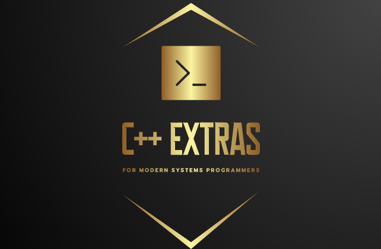

# [(perriera) / sample_app](https://github.com/perriera/sample_app)

Welcome to the **(perriera) / sample_app** project.

  
   

## Who would want to use this?

> This project aims to get you up and running with C++17 based project with a 'git clone' operation. As well, this particular C++ project template comes with builtin [CPM](https://github.com/cpm-cmake/CPM.cmake) support. This means that you can incorporate other [github](https://github.com) projects, (or anything that uses the git tool) into your project with the simple inclusion of a CPM directive in in your CMakeLists.txt file, (for C++11 support change the `--std=c++17` directive specified in CMAKE_CXX_FLAGS)

## Setup instructions
Assuming you have a Linux box setup you can create a project as follows:
> 1. [Generate your project using this template](https://github.com/perriera/sample_app/generate) 
> **NOTE**: 
> When you create your project the 'sample_app' specified  below will be replaced with your project name. 
> 2. Clone the project to local directory using either the https or ssh url 
> `git clone git@github.com:perriera/sample_app.git`
> 3. cd into the project and run the start up script 
> `cd sample_app` 
> `./RUNMEFIRST.sh` 
> **OPTIONAL**  
> When you specify a name for your project you may specify a sub name which will be converted into a namespace, (aka ***my_project*** instead of ***myproject*** ). In the case of sub name is **not** specified you will see a namespace called 'reassign' after the RUNMEFIRST.sh script is completed.

In the case where you don't have a Linux box already setup:
> 1. [How to setup a development environment (on Linux, Windows or Mac)](https://github.com/perriera/sample_app/blob/dev/docs/ENVIRONMENT.md)
> 2. [How to install the tools necessary for C++11/17 projects](https://github.com/perriera/sample_app/blob/dev/docs/INSTALL.md)
 >3. [How to clone your project (with this template)](https://github.com/perriera/sample_app/blob/dev/docs/CLONE.md)
> 4. [How to setup your changelog.md](https://github.com/perriera/sample_app/blob/dev/docs/CHANGELOG.md)

### Credits
> Markup Language created/edited with [SlackEdit.io](https://stackedit.io/app#) 
> C++ EXTRAS logo and CPM support compliments [Matt Williams](https://github.com/thebashpotato) 

### Copyright
> © 2023 Perry Anderson, (perry@exparx.ca) ([exparx.ca](https://www.exparx.ca/)) 
> [Open Source / MIT License](https://opensource.org/licenses/MIT) (see [LICENSE.md](https://github.com/perriera/sample_app/blob/dev/LICENSE.md)) 

